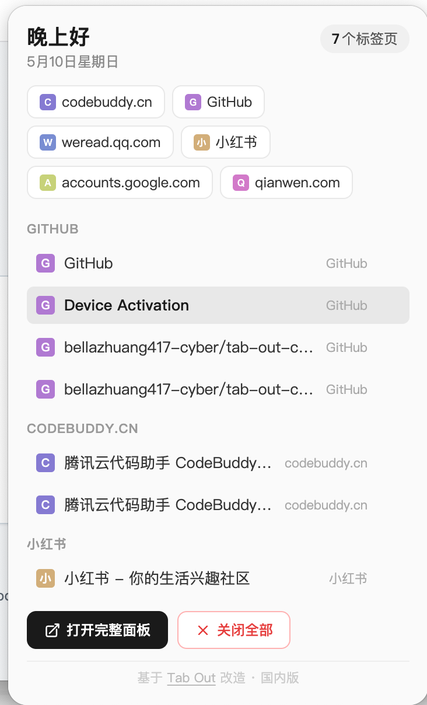
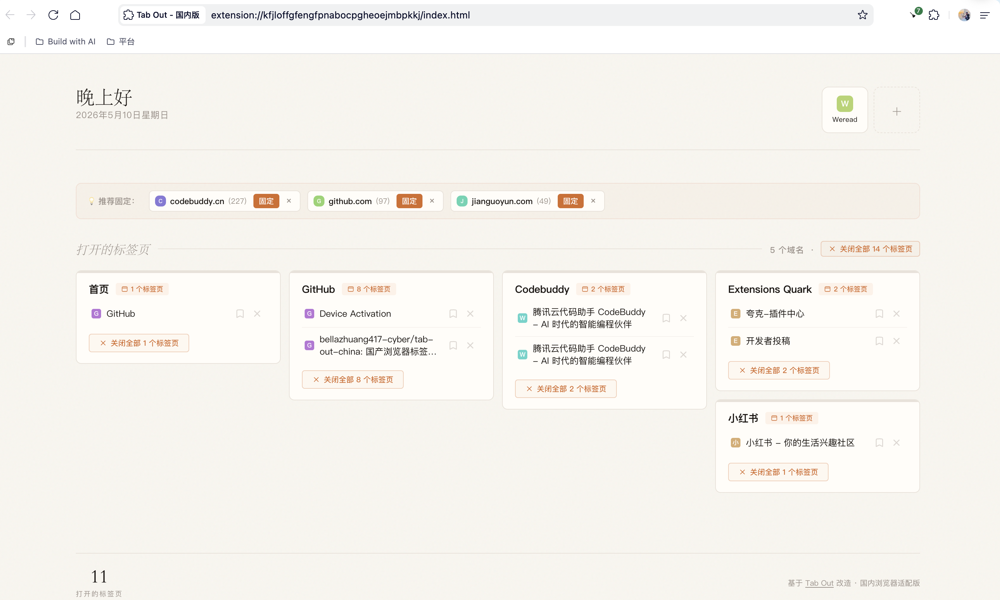

  

<h1 align="center">标签收纳师</h1>

  告别标签堆积，一键管理你的浏览器标签页 
  <strong>专为千问、夸克、360、UC 等国产浏览器打造</strong>

---

## 看看长什么样

### Popup 快捷面板

点击工具栏图标即可弹出，快速查看和管理标签页。

  

### Dashboard 完整面板

查看所有标签页、稍后阅读、重复标签检测，一个页面搞定。

  

---

## 功能

- **按域名分组** — 自动将标签页按网站归类，一眼看清打开了什么
- **快捷固定栏** — 常用网站一键直达，支持自定义（最多 8 个）
- **智能推荐** — 根据近 30 天浏览频率自动推荐固定
- **重复标签检测** — 自动发现重复页面，一键清理
- **稍后阅读** — 没看完的页面存起来，带归档和搜索功能
- **首页分组** — B 站、知乎、微博等首页单独归组，方便快速清理

---

## 支持的浏览器

- 千问浏览器
- 夸克浏览器
- 360 浏览器
- UC 浏览器
- QQ 浏览器
- 以及其他基于 Chromium 的国产浏览器

> 原版 Tab Out 通过覆盖新标签页工作，但国产浏览器锁死了新标签页的控制权。本插件改为 **Popup 弹出面板** 模式，点击图标即用，不依赖新标签页权限。

---

## 安装

1. **下载** 本仓库的 ZIP 压缩包并解压
2. 打开浏览器的 **扩展管理页面**
   - 千问：菜单 → 扩展程序（或地址栏输入 `chrome://extensions/`）
   - 夸克：菜单 → 扩展程序
   - 360：地址栏输入 `se://extensions`
3. 开启右上角 **开发者模式**
4. 点击 **「加载已解压的扩展程序」**，选择解压后的 `extension/` 文件夹
5. 安装完成！点击工具栏上的 **标签收纳师图标** 即可使用

> 安装后新标签页不会有变化，请点击工具栏图标来打开面板。

---

## 自定义快捷方式

编辑 `extension/config.local.js`，取消注释并填入你的常用网站即可。文件中有示例代码。

---

## 数据隐私

- 所有数据仅存储在你的浏览器本地
- 不需要账号、不需要登录
- 不收集任何用户数据、不联网传输

---

## 致谢

本插件灵感来源于博主 [Zara Zhang](https://github.com/zarazhangrui) 的开源项目 [Tab Out](https://github.com/zarazhangrui/tab-out)，在其基础上针对国产浏览器做了适配改造，并新增了快捷固定栏、智能推荐、稍后阅读等功能。

## 许可证

[MIT License](LICENSE)
